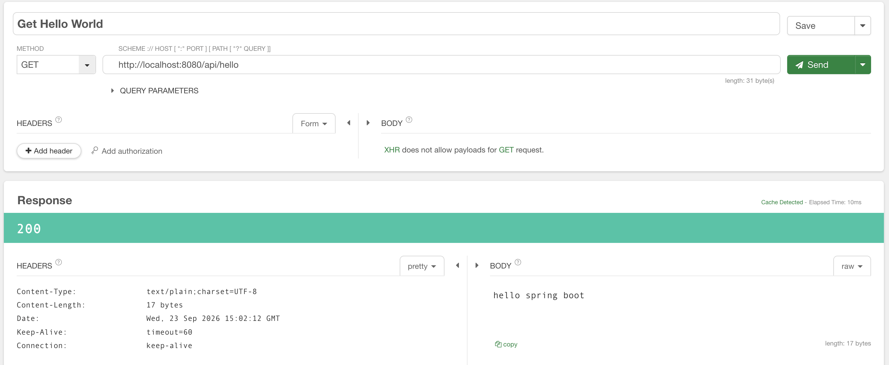

# Chapter 2. 스프링 부트

[전체 챕터 목차](../README.md)

스프링 부트로 웹 애플리케이션을 만들며 스프링의 기본 개념을 학습하는 챕터입니다.
현재는 프로젝트 구성과 첫 번째 GET API에 이어, GET 요청을 매핑하는 두 가지 방법과 경로 변수 전달을 학습했습니다.

## 개발 환경

| 항목 | 설정 |
| --- | --- |
| Java | JDK 25 (`build.gradle`의 Toolchain 설정) |
| Spring Boot | 4.1.1 |
| Gradle | 9.7.1 (Wrapper 포함) |
| 의존성 관리 플러그인 | `io.spring.dependency-management` 1.1.7 |
| 애플리케이션 이름 | `ch2-spring-boot` |

- `spring-boot-starter-webmvc`로 Spring MVC 기반 웹 애플리케이션을 구성합니다.
- 테스트에는 `spring-boot-starter-webmvc-test`와 JUnit Platform을 사용합니다.
- 현재 예제에는 데이터베이스나 별도의 외부 서버 설정이 필요하지 않습니다.

## 챕터 구조

```text
ch2-spring-boot/
├── README.md
├── build.gradle                 # 플러그인, 의존성, Java Toolchain 설정
├── settings.gradle              # Gradle 프로젝트 이름
├── gradlew / gradlew.bat         # macOS·Linux / Windows 실행 스크립트
├── gradle/wrapper/               # Gradle 배포 버전 및 Wrapper
├── docs/images/                 # API 실행 결과 스크린샷
└── src/
    ├── main/
    │   ├── java/org/honginsung/hello/
    │   │   ├── HelloApplication.java
    │   │   └── controller/
    │   │       ├── ApiController.java       # 첫 번째 Hello API
    │   │       └── GetApiController.java    # GET 매핑과 경로 변수 예제
    │   └── resources/
    │       └── application.properties
    └── test/java/org/honginsung/hello/
        └── HelloApplicationTests.java
```

## 학습 내용

### 1. 스프링 부트 애플리케이션 시작

`HelloApplication`이 애플리케이션의 시작점입니다.

- `@SpringBootApplication`으로 자동 설정과 컴포넌트 스캔 등을 활성화합니다.
- `main()`에서 `SpringApplication.run()`을 호출해 애플리케이션을 시작합니다.
- 하위 패키지인 `org.honginsung.hello.controller`의 컨트롤러가 스캔 대상에 포함됩니다.
- `application.properties`에서 `spring.application.name=ch2-spring-boot`를 설정합니다.

### 2. REST 컨트롤러와 GET 요청

`ApiController`는 `/api/hello` 요청을 처리합니다.

| 어노테이션 | 역할 |
| --- | --- |
| `@RestController` | 요청을 처리하는 컨트롤러로 등록하고 메서드 반환값을 응답 본문에 사용 |
| `@RequestMapping("/api")` | 컨트롤러의 공통 URL 경로 지정 |
| `@GetMapping("/hello")` | GET 요청의 세부 경로와 처리 메서드 연결 |

컨트롤러 경로와 메서드 경로를 합친 `GET /api/hello` 요청이 `hello()`로 전달되고, 반환한 `hello spring boot` 문자열이 응답 본문이 됩니다.

### 3. GET 요청 매핑

`GetApiController`는 클래스에 `@RequestMapping("/api/get")`을 선언해 공통 경로를 지정합니다.

- `getHello()`는 `@GetMapping(path = "/hello")`로 GET 요청을 처리하고 `get hello`를 반환합니다.
- `hi()`는 `@RequestMapping(path = "/hi", method = RequestMethod.GET)`으로 GET 요청을 처리하고 `get hi`를 반환합니다.

`@GetMapping`은 GET 요청 매핑을 간결하게 표현하는 방식입니다. `@RequestMapping`을 사용할 때는 이 예제처럼 `method`로 HTTP 메서드를 지정할 수 있습니다.

### 4. 경로 변수 (`@PathVariable`)

`GET /api/get/path-variable/{name}`은 URL 경로의 값을 메서드 인자로 전달하는 예제입니다.

- `@GetMapping("/path-variable/{name}")`의 `{name}`이 값을 받을 위치입니다.
- `@PathVariable(name = "name") String pathName`은 경로 변수 `name`을 자바 매개변수 `pathName`에 연결합니다. 명시적으로 이름을 지정했으므로 두 이름이 달라도 값을 받을 수 있습니다.
- 메서드는 전달받은 값을 `PathVariable : 값` 형태로 콘솔에 출력하고, 같은 값을 응답 본문으로 반환합니다.

예를 들어 `/api/get/path-variable/spring`을 요청하면 응답 본문은 `spring`입니다.

## API 목록

| HTTP 메서드 | 경로 | 정상 응답 상태 | 응답 본문 |
| --- | --- | --- | --- |
| GET | `/api/hello` | `200 OK` | `hello spring boot` |
| GET | `/api/get/hello` | `200 OK` | `get hello` |
| GET | `/api/get/hi` | `200 OK` | `get hi` |
| GET | `/api/get/path-variable/{name}` | `200 OK` | 경로에 전달한 `name` 값 |

모든 예제는 문자열을 응답 본문으로 반환합니다.

## 실행 방법

아래 명령은 macOS·Linux 셸 기준입니다. 저장소 루트에서 챕터 폴더로 이동한 뒤 실행합니다. Windows에서는 `./gradlew` 대신 `gradlew.bat`을 사용합니다.

```bash
cd ch2-spring-boot
java -version
./gradlew --version
```

이 챕터는 JDK 25 Toolchain을 요구하므로 JDK 25를 설치해야 합니다. Chapter 1에서 사용하는 JDK 26과 별도로 설치할 수 있습니다. 최초 실행 시 Gradle과 의존성을 다운로드하기 위한 인터넷 연결이 필요합니다.

### 개발 서버 실행

```bash
./gradlew bootRun
```

현재 포트 설정을 변경하지 않았으므로 기본 주소는 `http://localhost:8080`입니다. 서버가 시작되면 별도 터미널에서 요청합니다.

```bash
curl -i http://localhost:8080/api/hello
```

응답 상태는 `200 OK`, 본문은 다음 문자열입니다.

```text
hello spring boot
```

아래는 API 클라이언트에서 `GET /api/hello`를 호출해 상태 코드 `200`과 `hello spring boot` 응답을 확인한 화면입니다.



브라우저에서 [Hello API](http://localhost:8080/api/hello)를 열어도 확인할 수 있습니다. 서버 종료는 실행 중인 터미널에서 `Ctrl+C`를 누릅니다.

8080 포트를 다른 프로그램이 사용하고 있다면 실행 포트를 지정할 수 있습니다. 요청 URL의 포트도 함께 변경합니다.

```bash
./gradlew bootRun --args='--server.port=8081'
```

### GET 요청과 경로 변수 확인

서버를 실행한 상태에서 각 요청을 보내 응답을 확인합니다.

```bash
curl -i http://localhost:8080/api/get/hello
curl -i http://localhost:8080/api/get/hi
curl -i http://localhost:8080/api/get/path-variable/spring
```

각 응답은 `200 OK`이며 본문은 순서대로 `get hello`, `get hi`, `spring`입니다. 마지막 요청에서는 서버 콘솔에도 `PathVariable : spring`이 출력됩니다.

### 테스트 및 빌드

```bash
./gradlew test
./gradlew build
```

`HelloApplicationTests.contextLoads()`는 `@SpringBootTest`로 애플리케이션 컨텍스트가 정상적으로 로딩되는지 확인합니다. 현재 테스트에는 API 응답을 검증하는 별도 단언문은 없습니다.

`build`는 테스트를 포함해 실행 가능한 JAR을 생성합니다. 테스트 보고서는 `build/reports/tests/test/index.html`에서 확인할 수 있습니다.

빌드한 애플리케이션을 JDK 25 이상의 `java` 명령으로 실행할 수도 있습니다.

```bash
java -jar build/libs/ch2-spring-boot-0.0.1-SNAPSHOT.jar
```

### IntelliJ IDEA

1. `ch2-spring-boot/build.gradle`을 Gradle 프로젝트로 열거나 연결합니다.
2. JDK 25를 등록하고 Gradle JVM을 JDK 25로 설정합니다.
3. Gradle 동기화가 완료되면 `HelloApplication.main()`을 실행합니다.
4. `http://localhost:8080/api/hello`에 접속해 응답을 확인합니다.

빌드 결과와 Gradle 캐시는 `.gitignore`로 제외되며, 실행에 필요한 Gradle Wrapper는 저장소에 포함됩니다.
